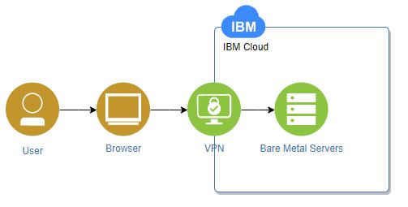

# BareMetal guide - Schematics IBM Cloud

_Ejemplo de BareMetal con facturación por **HORAS** en Infraestructura clásica usando IaC en Schematics con el provvider de Terraform_

## Comenzando 🚀

_Instrucciones_

Para el aprovisionamiento de un BareMetal se debe contar con minimo 3 archivos en GITHUB los cuales son:
- variable.tf = Contiene las variables de llaves y nombres unicos que el cliente introduce en su servicio
- recursos.tf = Solicita aprovisionamiento del servicio que se requiere (en este caso BareMetal)
- provider.tf = Instalador de provider IBM sobre Schematics

### Variable.tf 📋

El aprovisionamiento de un BareMetal con el provider terraform requiere de por lo menos las siguientes variables:

| Variable | Información |
| ------------- | ------------- |
| **ibmcloud_apikey**  | [API key](https://cloud.ibm.com/docs/iam?topic=iam-userapikey) unica del usuario que se requiere para aprovisionamiento de recursos |
| **ibm_region**  | Region en la que se encuentra ubicado el datacenter donde se aprovisionará el recurso |
| **resource_group** | Grupo de recursos en cual se aprovisiona el recurso |
| **bm_hostname** | Nombre del BareMetal a provisionar _No mayusculas_ |
| **os_reference** | Referencia del sistema operativo a instalar sobre el BareMetal (Depende de la capacidad del procesador elegida|
|**datacenter**| Datacenter en el cual se aprovisionará el BareMetal|

_Necesitas una cuenta en IBM Cloud_

### Pasos de acceso a api_softlayer 🔧

_En este codigo se tiene que tener en cuenta 
_Para obtener la apikey_softlayer se debe ir a **Access(IAM)>Users>"Tu usuario">Classic infrastructure"**_

---
⌨️ con ❤️ por Fernando Coy 😊
