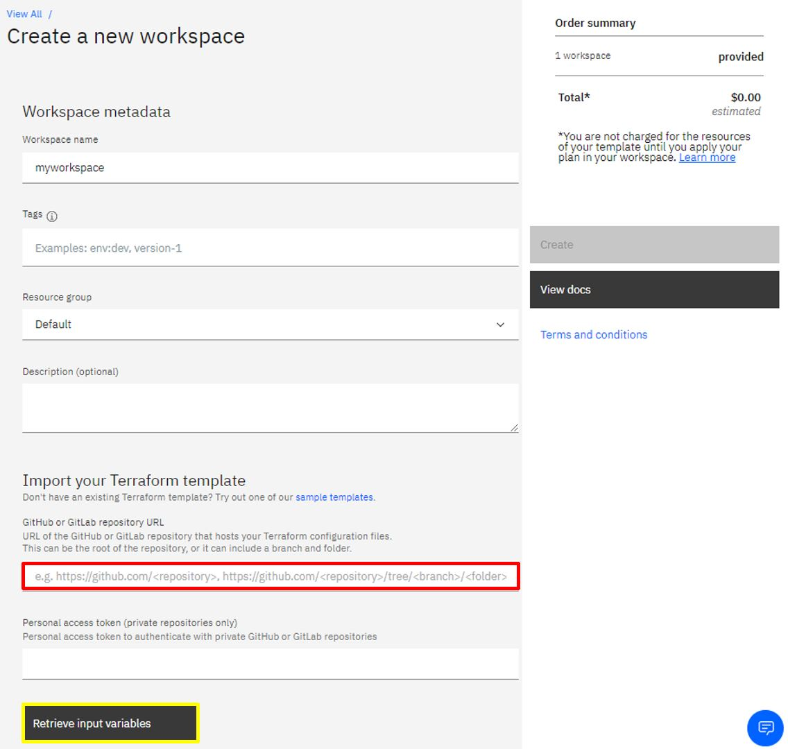

# BareMetal-ESX VMware - Schematics IBM Cloud

_Ejemplo de BareMetal con ESXI par virtualización VMware con facturación por **MENSUAL** en Infraestructura clásica usando IaC en Schematics con el provider de Terraform_

## Introducción 

VMware ESXi (anteriormente VMware ESX) es una plataforma de virtualización a nivel de centro de datos producido por VMware, Inc.

## Comenzando 🚀

_Instrucciones_

Para el aprovisionamiento de un BareMetal-ESXI se requiere facturación mensual y configuración de capacidades que soporten este OS.
Los archivos necesarios para la configuración de IaC son los siguientes:
- variable.tf = Contiene las variables de llaves y nombres unicos que el cliente introduce en su servicio
- main.tf = Archivo principal que contiene las funciones de aprovisionamiento de recursos 
- provider.tf = Instalador de provider IBM sobre Schematics

### Variables 📋

El aprovisionamiento de un BareMetal mensual con el provider terraform cuenta con las siguientes caracteristicas:

| Variable | Información |
| ------------- | ------------- |
| **ibmcloud_apikey**  | [API key](https://cloud.ibm.com/docs/iam?topic=iam-userapikey) unica del usuario que se requiere para aprovisionamiento de recursos |
| **ibm_region**  | Region en la que se encuentra ubicado el datacenter donde se aprovisionará el recurso |
| **bm_hostname** | Nombre del BareMetal a provisionar _No mayusculas_ |
| **bm_os_reference_code** | Referencia del paquete de sistemas operativos a instalar sobre el BareMetal (Depende de la capacidad del procesador elegida)|
|**datacenter**| [Datacenter](https://api.softlayer.com/rest/v3/SoftLayer_Hardware/getCreateObjectOptions.json) en el cual se aprovisionará el BareMetal |
| **bm_domain** | Dominio del Baremetal ´nombre del dominio´.cloud.com |
| **bm_network_speed** | Velocidad de la red |
| **private_network** | Si se requiere de un enlace a la red publica se coloca _false_ de lo contrario _true_ |
| **processor** | [Script con nombres clave de paquetes de procesador](https://api.softlayer.com/rest/v3/SoftLayer_Product_Package/getAllObjects?objectFilter={%22type%22:{%22keyName%22:{%22operation%22:%22BARE_METAL_CPU%22}}}) a instalar sobre el BareMetal (Depende de la capacidad del procesador elegida|
| **key_process** | [Script con nombres clave de procesador](https://api.softlayer.com/rest/v3/SoftLayer_Product_Package/getAllObjects?objectFilter={%22type%22:{%22keyName%22:{%22operation%22:%22BARE_METAL_CPU%22}}}) a instalar sobre el BareMetal (Depende de la capacidad del procesador elegida |
| **disk_key_name** | Nombre clave de disco(s) de almacenamiento |
| **notes** | Notas de información del BareMetal |

Para acceder a información de **api softlayer** se requiere de la [APIkey-ClassicInfrastructure](https://cloud.ibm.com/docs/iam?topic=iam-classic_keys&locale=es) y el usuario de la cuenta EJ: **22222_user@ibm.com**

La variable **bm_os_reference_code** cuenta con las siguientes opciones para SAP - Certified

- OS_VMWARE_SERVER_VIRTUALIZATION_6_5_0_U2 ( VMware Server Virtualization 6.5 Update 2 )
- OS_VMWARE_SERVER_VIRTUALIZATION_6_5_UPDATE_1G ( VMware Server Virtualization 6.5 Update 1g )

El atributo **disk_key_name** cuenta con las siguientes opciones

- HARD_DRIVE_1_00_TB_SATA_2 ( 1.00 TB SATA )
- HARD_DRIVE_2_00_TB_SATA_2 ( 2.00 TB SATA )
- HARD_DRIVE_3_00_TB_SATA ( 3.00 TB SATA )
- HARD_DRIVE_1_7_TB_SSD_3_DWPD ( 1.7TB SSD (3 DWPD) ) 
- HARD_DRIVE_3_8TB_SSD_SED_3DWPD ( 3.8TB SSD SED (3DWPD) )
- HARD_DRIVE_2_00_TB_SATA_2_BMR_1U_1YR_TERM ( 2.00 TB SATA )
- HARD_DRIVE_7_68TB_SSD_1DWPD ( 7.68TB SSD )
- HARD_DRIVE_8_00_TB_SATA ( 8.00 TB SATA  ) 
- HARD_DRIVE_960GB_SSD ( 960GB SSD (3 DWPD) ) 
- HARD_DRIVE_4_00TB_SATA_III ( 4.00 TB SATA  ) 
- HARD_DRIVE_600_GB_SAS_15K_RPM ( 600 GB SAS (15K RPM) ) 
- HARD_DRIVE_960GB_SSD_SED_5DWPD ( 960GB SSD SED (5DWPD) ) 
- HARD_DRIVE_800GB_SSD ( 800GB SSD (10 DWPD) )
- HARD_DRIVE_7_68TB_SSD_SED_1DWPD ( 7.68TB SSD SED ) 

### Pasos para el despliegue en Schematics 🔧

Se debe dirigir al simbolo de  en donde encontrará la opción de **Schematics** una vez alli se creará un nuevo workspace donde se contará con la siguiente pestaña:

En el espacio sobremarcado con rojo se debe pegar el link del repositorio y de ser necesario en la parte de abajo el Token para permisos de acceso. Se presiona el botón sobremarcado con amarillo para adquirir las variables a rellenar. Luego de rellenarlas se debe crear el workspace. En caso de realizar el procedimiento de forma correcta se contará con la siguiente pestaña:

Se debe generar el plan con el botón que aparece en pantalla y de generarse correctamente se podrá aplicar el plan. _Solo hasta aplicar el plan se va a generar facturación_

---
#### Autores: IBM Cloud Tech Sales
