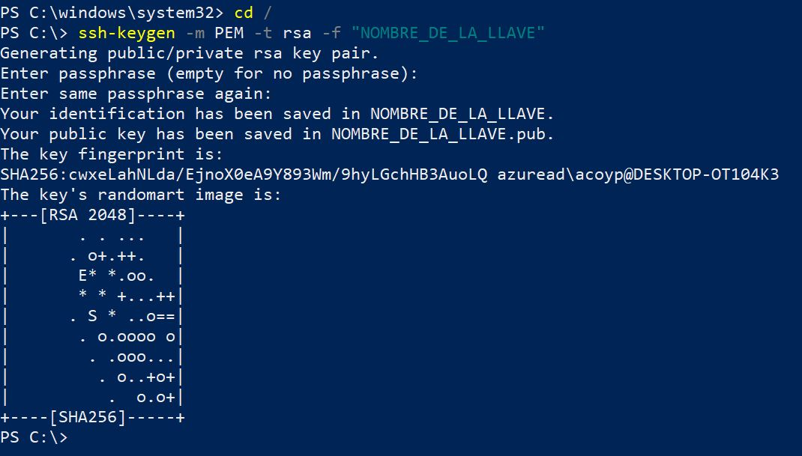
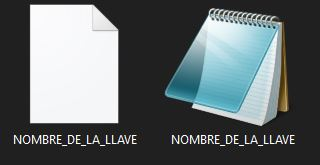
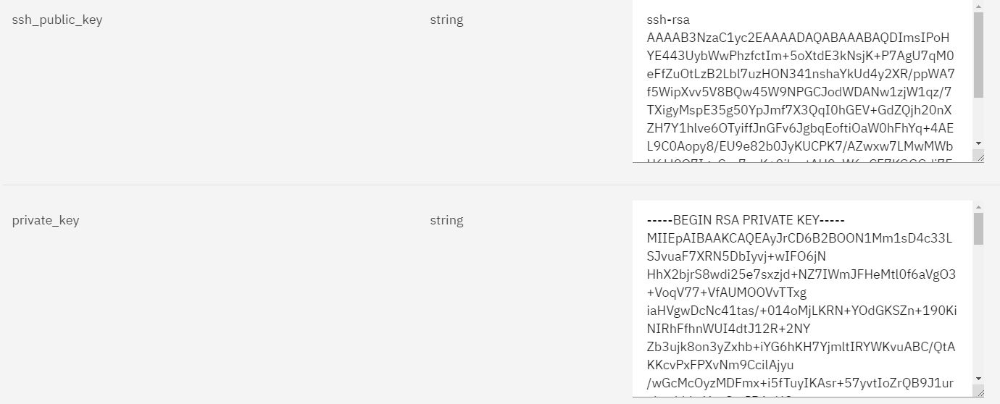
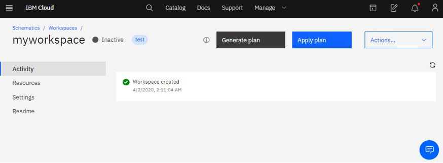
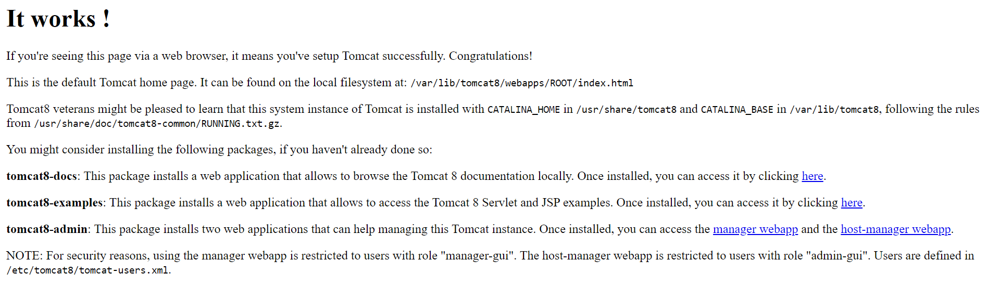

# Virtual Server-Aprovisionamiento y configuración de Tomcat con Chef Infra mediante Terraform :cloud:

_Ejemplo de aprovisionamiento de una VSI configurando a su vez Tomcat de forma autimatizada haciendo uso de Chef Infra_


## Terraform :triangular_flag_on_post:

Terraform es una herramienta de aprovisionamiento de infraestructura que utiliza aprovisionadores, en este caso se hace uso del aprovisionador de ejecución remota para correr un conjunto de comandos en línea en la máquina recién creada y, de esta forma, instalar un chef workstation y automatizar la creación de un servidor tomcat.

### Instrucciones :bookmark_tabs:

Para el aprovisionamiento de una VSI se requiere de mínimo tres archivos .tf de configuración los cuales son:
- variable.tf = Contiene las variables de llaves y nombres unicos que el cliente introduce en su servicio
- main.tf = Archivo principal que contiene las funciones de aprovisionamiento de recursos 
- provider.tf = Instalador de provider IBM sobre Schematics


### Variables 📋

El aprovisionamiento de un VSI :

| Variable | Información |
| ------------- | ------------- |
| **ibmcloud_apikey**  | [API key](https://cloud.ibm.com/docs/iam?topic=iam-userapikey) unica del usuario que se requiere para aprovisionamiento de recursos |
| **hostname**  | Nombre de la VSI a aprovisionar |
| **domain**  | Dominio del recurso a aprovisionar |
| **datacenter**  | Datacenter donde se aprovisionará el recurso VSI |
| **os_reference**  | Referencia de Sistema Operativo del Servidor Virtual |
| **network_speed**  | Velocidad de red de conexión del recurso () |
| **hourly_billing**  | Tipo de facturación de la VSI _**true** = facturación por horas_ o _**false** = facturación mensual_ |
| **network_mode**  | Tipo de conexión a la red _**true** = Red unicamente privada_ o _**false** = Red publica y privada_ |
| **cores**  | Configuración de nucleos de la VSI |
| **memory**  | Memoria RAM de la VSI **Gigas de memoria RAM * 1024** ---- EJ : _2 Gb = 2048_ / _10 Gb = 10240_|
| **ssh_public_key**  | Llave publica generada. Mas información: https://www.ssh.com/ssh/keygen/ |
| **private_key**  | Llave privada generada. Mas información: https://www.ssh.com/ssh/keygen/ |
| **cookbook_git**  | Repositorio que contiene el Github a ejecutar con CHEF |
| **cookbook_name**  | Nombre del cookbook importado |


## Chef :fork_and_knife: :triangular_flag_on_post:

Chef Infra es un marco de automatización de infraestructura de código abierto que permite definir el estado de su infraestructura y mantenerlos de forma automatizada. El flujo de trabajo normal de Chef implica la administración remota de servidores desde un workstation, pero en esta guía ejecutará chef-client "local-mode", para ejecutar chef sin un Chef Server externo.

A continuación encontrará una descripción de los comandos utilizados en el provisioner "remote-exec" de nuestra plantilla de terraform. Estos comandos los encontrará en el archivo main.tf.

### Comandos del provisioner "remote-exec" ⚙️

Para comenzar se instala Chef Workstation mediante los siguientes comandos:

```sh
wget -nv -P /downloads https://packages.chef.io/files/stable/chef-workstation/0.18.3/ubuntu/18.04/chef-workstation_0.18.3-1_amd64.deb
dpkg -i /downloads/chef-workstation_0.18.3-1_amd64.deb
```
Luego de esto se genera un chef-repo, que es un directorio dentro del workstation que almacena todo lo que necesita para definir su infraestructura, adicionalmente se establece “yes” como respuesta a las preguntas generadas al ejecutar el comando con el fin de automatizar el proceso.

```sh
echo yes | chef generate repo chef-repo
```
Es necesario ingresar a la carpeta cookbooks dentro del chef-repo generado y clonar el repositorio de GitHub que contiene nuestro cookbook llamado tomcatcb el cual podrá encontrar en el siguiente link [tomcatcb](https://github.com/JulianaLeonGonzalez/tomcatcb), para este proceso se usan los siguientes comandos:

```sh
cd chef-repo/cookbooks 
git clone https://github.com/JulianaLeonGonzalez/tomcatcb.git
```

**Nota:** Si se desea crear un cookbook desde la consola, el comando anterior podría ser reemplazado por: _chef generate cookbook chef-repo/cookbooks/tomcatcb_ o si desea encuentre más información sobre los cookbooks en este link [información de cookbooks](https://docs.chef.io/cookbooks/).

Los siguientes comandos son utilizados para ubicarse en el chef-repo y luego ejecutar nuestro cookbook.
```sh
cd ..
chef-client --local-mode --override-runlist cookbook
```

## Despliegue en Schematics :wrench: :triangular_flag_on_post:

Se debe dirigir al simbolo de  en donde encontrará la opción de **Schematics** una vez alli se creará un nuevo workspace donde se contará con la siguiente pestaña:
 

Para la configuración de la SSH Keys se debe abrir la terminar del PC en ingresar el comando 
**ssh-keygen -m PEM -t rsa -f "NOMBRE_DE_LA_LLAVE"**



Al ejecutar el comando se crearan dos archivos. Uno de ellos con extensión .pub cuyo contenido de texto contiene una llave SSH publica. El otro archivos no tiene extensión y contiene la llave SSH privada. Se deben copiar y pegar cada una de ellas en las variables definidas anteriormente.



Luego de tener estas llaves se agregan a las variables de entrada como se muestra a continuación:



En el espacio sobremarcado con rojo se debe pegar el link del repositorio y de ser necesario en la parte de abajo el Token para permisos de acceso. Se presiona el botón sobremarcado con amarillo para adquirir las variables a rellenar. Luego de rellenarlas se debe crear el workspace. En caso de realizar el procedimiento de forma correcta se contará con la siguiente pestaña:



Se debe generar el plan con el botón que aparece en pantalla y de generarse correctamente se podrá aplicar el plan. _Solo hasta aplicar el plan se va a generar facturación_

## Resultados  :computer: :triangular_flag_on_post:

En su buscador web de preferencia ingrese el dirección IP de su máquina seguida del puerto 8080, encontrará un resultado como el que se muestra a continuación:



## Referencias  :mag: :triangular_flag_on_post:

Encuentre información sobre terraform en IBM cloud en: [Managing IBM Cloud resources with Terraform](https://cloud.ibm.com/docs/terraform?topic=terraform-manage_resources)
<br>
Encuentre información sobre chef en: [Learn Chef ](https://learn.chef.io/modules/learn-the-basics#/)
<br>
Encuentre informacipon sobre los cookbooks y recipes de chef en: [Cookboos & recipes ](https://docs.chef.io/ruby/) 

### Autores: IBM Cloud Tech Sales
